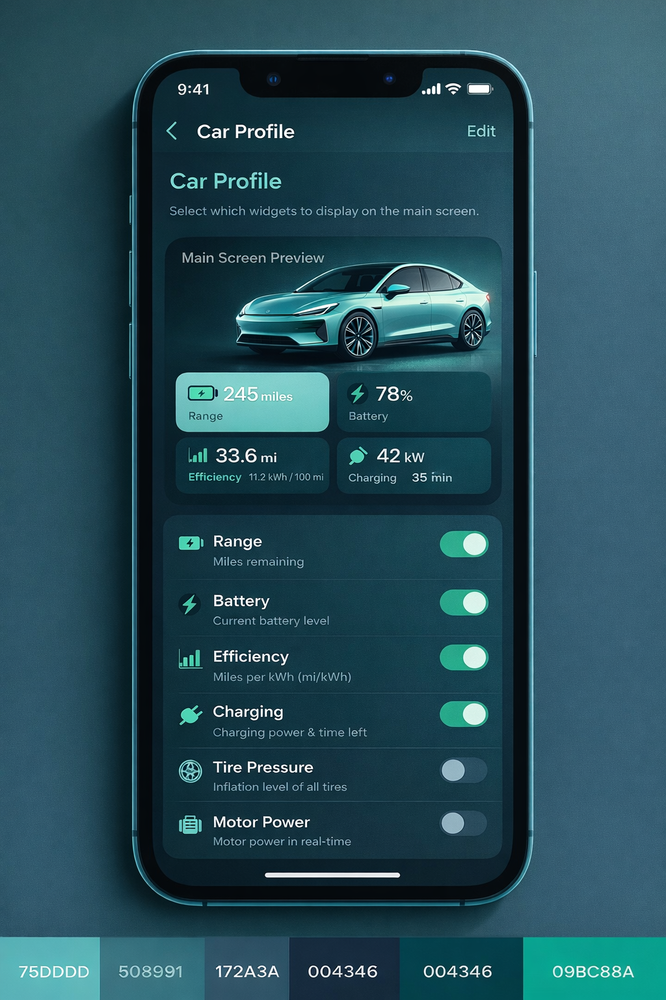
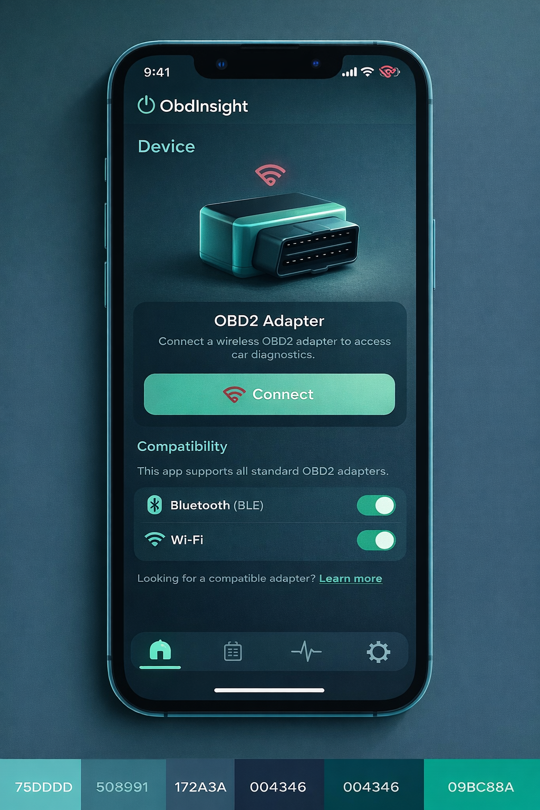
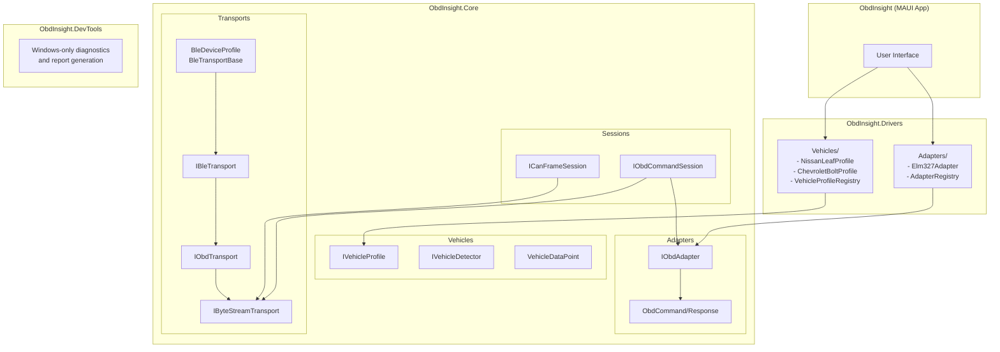

# ObdInsight

[](https://opensource.org/licenses/MIT)
[](https://dotnet.microsoft.com/apps/maui)

A modern, open-source OBD-II diagnostic application for Android and iOS built with .NET MAUI. 

ObdInsight addresses the poor user experience of existing OBD apps by providing a clean, responsive interface backed by a robust, testable architecture. The pluggable driver system makes it easy to add support for new Bluetooth and WiFi OBD dongles without modifying the core application.

## UI Mockups

The following are design mockups showcasing the planned user interface:

<div align="center">

<p><em>Main Page - View widgets</em></p>
</div>

<div align="center">
  
  <p><em>Car Profile Page - View and manage vehicle information</em></p>
</div>

<div align="center">
  
  <p><em>Devices Page - Connect to OBD-II adapters</em></p>
</div>

> **Note**: These are mockup images representing the planned UI design and may not reflect the current implementation.

## Table of Contents

- [Why ObdInsight?](#why-obdinsight)
- [Architecture](#architecture)
- [Getting Started](#getting-started)
- [Adding New Vehicle Support](#adding-new-vehicle-support)
- [Adding New Adapter Support](#adding-new-adapter-support)
- [Requesting New Vehicle or Adapter Support](#requesting-new-vehicle-or-adapter-support)
- [Contributing](#contributing)
- [License](#license)

## Why ObdInsight?

- **Better UX**: Designed mobile-first with modern UI patterns
- **Extensible**: Plugin-based architecture for easy adapter and vehicle support
- **Testable**: Adapters and vehicle profiles can be developed and tested independently
- **Cross-platform**: Single codebase for Android and iOS using .NET MAUI
- **Open**: Community contributions welcome

## Architecture

ObdInsight uses a layered architecture that clearly separates:

1. **Core**: Interface contracts and base types (no concrete implementations)
2. **Drivers**: Concrete adapter and vehicle profile implementations
3. **Transports**: Communication layer (BLE, WiFi, Serial, USB)
4. **Sessions**: Command-based (ELM/STN) vs. frame-based (CAN) communication

This separation means you can add support for new OBD dongles, vehicles, or transport methods without modifying core contracts.



**Key Architectural Principles:**

- **Core = Contracts Only**: No concrete implementations in Core (only interfaces, base types, and abstractions)
- **Drivers = Implementations**: All concrete adapters (e.g., Elm327Adapter) and vehicle profiles live in Drivers
- **Transport Abstraction**: `IByteStreamTransport` enables any communication channel (BLE, WiFi, Serial, USB)
- **Session Abstraction**: Separates command-oriented (ELM327/STN) from frame-oriented (raw CAN) communication
- **Dependency Injection**: Services accept interfaces, implementations are injected at runtime

**Alternative: ASCII Diagram**

```
┌─────────────────────────────────────────────────────────────┐
│                 ObdInsight (MAUI App)                       │
└─────────────────────────────────────────────────────────────┘
                              ↓
┌─────────────────────────────────────────────────────────────┐
│                 ObdInsight.Drivers                          │
│  ┌──────────────────────┐    ┌──────────────────────┐      │
│  │  Adapters/           │    │  Vehicles/           │      │
│  │  - Elm327Adapter     │    │  - NissanLeafProfile │      │
│  │  - AdapterRegistry   │    │  - ChevroletBolt     │      │
│  │                      │    │    Profile           │      │
│  │                      │    │  - VehicleProfile    │      │
│  │                      │    │    Registry          │      │
│  └──────────────────────┘    └──────────────────────┘      │
└─────────────────────────────────────────────────────────────┘
                              ↓
┌─────────────────────────────────────────────────────────────┐
│                 ObdInsight.Core (Interfaces Only)           │
│  ┌──────────────────────┐    ┌──────────────────────┐      │
│  │  Adapters/           │    │  Sessions/           │      │
│  │  - IObdAdapter       │    │  - IObdCommandSession│      │
│  │  - ObdCommand        │    │  - ICanFrameSession  │      │
│  │  - ObdResponse       │    │                      │      │
│  └──────────────────────┘    └──────────────────────┘      │
│  ┌──────────────────────┐    ┌──────────────────────┐      │
│  │  Vehicles/           │    │  Transports/         │      │
│  │  - IVehicleProfile   │    │  - IByteStreamTrans  │      │
│  │  - IVehicleDetector  │    │    port              │      │
│  │  - VehicleDataPoint  │    │  - IObdTransport     │      │
│  │                      │    │  - IBleTransport     │      │
│  └──────────────────────┘    └──────────────────────┘      │
└─────────────────────────────────────────────────────────────┘
```

### Key Components

| Namespace | Purpose |
|-----------|---------|
| `ObdInsight.Core.Transports` | Transport interfaces (IByteStreamTransport, IObdTransport, IBleTransport) |
| `ObdInsight.Core.Adapters` | Adapter contracts (IObdAdapter, ObdCommand, ObdResponse) |
| `ObdInsight.Core.Sessions` | Session abstractions (IObdCommandSession, ICanFrameSession) |
| `ObdInsight.Core.Vehicles` | Vehicle profile interfaces and data types |
| `ObdInsight.Drivers.Adapters` | Concrete adapter implementations (Elm327Adapter, AdapterRegistry) |
| `ObdInsight.Drivers.Vehicles` | Built-in vehicle profiles (NissanLeafProfile, ChevroletBoltProfile) |

## Getting Started

### Prerequisites

- [.NET 9 SDK](https://dotnet.microsoft.com/download/dotnet/9.0)
- For mobile development:
  - **Android**: Android SDK (API 21+)
  - **iOS**: Xcode 14+ (macOS only)
- For DevTools (Windows only):
  - Windows 10/11 with Bluetooth Low Energy support
- OBD-II Bluetooth adapter (ELM327-compatible recommended)
- Vehicle with OBD-II port (1996+ for US vehicles)

### Building the Project

```bash
# Clone the repository
git clone https://github.com/kfrancis/ObdInsight.git
cd ObdInsight

# Restore dependencies
dotnet restore

# Build the solution
dotnet build

# Run on Android (requires Android device/emulator)
dotnet build -t:Run -f net9.0-android

# Run on iOS (requires macOS with Xcode)
dotnet build -t:Run -f net9.0-ios

# Run DevTools (Windows only)
cd src/ObdInsight.DevTools
dotnet run
```

## Adding New Vehicle Support

To add support for a new vehicle:

1. Create a class implementing `IVehicleProfile` in `ObdInsight.Drivers.Vehicles/`
2. Define VIN prefixes for auto-detection
3. Add custom PIDs for vehicle-specific data
4. Implement decoders for each PID
5. Register in `VehicleProfileRegistry`

Example:
```csharp
public class MyVehicleProfile : IVehicleProfile
{
    public string Name => "My Vehicle";
    public string Manufacturer => "MyMfg";
    public bool IsElectric => true;
    public IReadOnlyList<string> VinPrefixes => ["ABC", "XYZ"];
    
    public IReadOnlyList<VehiclePid> CustomPids => [
        new VehiclePid("Battery SOC", "220100", VehicleDataPoint.BatteryStateOfCharge, "%")
        {
            Decoder = bytes => bytes[0] / 2.55
        }
    ];
    // ... implement remaining interface members
}
```

## Adding New Adapter Support

To add support for a new OBD adapter:

1. Create a class implementing `IObdAdapter` in `src/ObdInsight.Drivers/Adapters/YourAdapter/`
2. Implement the adapter interface:
   - `InitializeAsync`: Set up the adapter and negotiate protocol
   - `SendCommandAsync`: Send OBD commands and parse responses
   - `ResetAsync`: Reset adapter to default state
3. Update namespace to `ObdInsight.Drivers.Adapters.YourAdapter`
4. Register in `AdapterRegistry.GetAllAdapters()` method in `src/ObdInsight.Drivers/Adapters/AdapterRegistry.cs`

Example:
```csharp
namespace ObdInsight.Drivers.Adapters.Stn1110;

public class Stn1110Adapter : IObdAdapter
{
    public string Name => "STN1110";
    public bool IsInitialized { get; private set; }
    public string[] SupportedDeviceNames => ["STN1110", "OBDLink"];
    
    public async Task<bool> InitializeAsync(IObdTransport transport, CancellationToken ct)
    {
        // Your initialization logic
    }
    
    public async Task<ObdResponse> SendCommandAsync(ObdCommand command, CancellationToken ct)
    {
        // Your command/response logic
    }
    
    // ... implement remaining interface members
}
```

Then register in `AdapterRegistry`:
```csharp
yield return new AdapterInfo(
    Name: "STN1110",
    Description: "STN1110 high-performance OBD adapter",
    SupportedDeviceNames: ["STN1110", "OBDLink"],
    Factory: () => new Stn1110Adapter()
);
```

## Requesting New Vehicle or Adapter Support

If your vehicle or OBD adapter isn't supported, you can help us add support by generating a diagnostic report. This report collects essential information about your vehicle's OBD communication that developers need to create a vehicle profile.

### Prerequisites

- Windows PC with Bluetooth Low Energy support
- OBD-II Bluetooth adapter (ELM327-compatible)
- Vehicle with OBD-II port (1996+ for US vehicles)
- .NET 9 SDK installed

### Generating a Diagnostic Report

1. **Build and run the DevTools**
   ```bash
   cd src/ObdInsight.DevTools
   dotnet run
   ```

2. **Select "Generate Vehicle Support Report"** from the menu

3. **Enter your vehicle information**
   - Year, Make, Model, Trim
   - Engine/Powertrain type (Gasoline, Diesel, Hybrid, Electric, etc.)
   - Transmission type

4. **Enter your OBD adapter's MAC address**
   - If you don't know it, use "Scan for BLE devices" first to find it

5. **Select your BLE adapter profile**
   - Veepeak BLE+ is the default
   - Choose "Auto-detect" if unsure

6. **Start the vehicle** (ignition on or engine running)

7. **Wait for the diagnostic collection to complete**
   - The tool will probe your vehicle's supported PIDs
   - It collects VIN, adapter info, and protocol details
   - EV-specific PIDs are also tested

8. **A markdown report file will be generated** in the current directory

### Submitting Your Report

1. Open a new issue at: https://github.com/kfrancis/ObdInsight/issues/new

2. Use the title format: `Vehicle Support: [Year] [Make] [Model]`
   - Example: `Vehicle Support: 2023 Hyundai Ioniq 6`

3. Copy the entire contents of the generated markdown file into the issue body

4. Add any additional observations:
   - Did certain features work/not work?
   - Any unusual behavior noticed?
   - Other OBD apps that work with your vehicle (for reference)

### What the Report Contains

The diagnostic report includes:

| Section | Description |
|---------|-------------|
| Vehicle Information | Your provided year, make, model, and powertrain details |
| BLE Adapter Info | GATT services and characteristics discovered |
| OBD Adapter Info | ELM327 version, voltage, protocol detection |
| Vehicle Identification | VIN (partially masked for privacy), ECU name, calibration ID |
| Supported PIDs | List of all PIDs your vehicle responds to |
| PID Responses | Raw responses from standard and EV-specific PIDs |
| Errors | Any communication issues encountered |

> **Privacy Note**: The VIN's last 6 characters are automatically masked in the report. The VIN prefix helps identify vehicle make/model/year for profile matching.

### For Adapter Support Requests

If you have an OBD adapter that isn't connecting properly:

1. Run "Scan for BLE devices" to verify the adapter is discoverable
2. Run "Discover device services" to see the GATT service/characteristic UUIDs
3. Include this information in your GitHub issue with the title: `Adapter Support: [Adapter Name]`

## Contributing

Contributions are welcome! Areas where help is especially appreciated:

- **Vehicle Profiles**: Add support for new vehicles by implementing `IVehicleProfile`
- **OBD Adapters**: Add support for new BLE/WiFi adapters
- **Testing**: Generate diagnostic reports for vehicles you own
- **Documentation**: Improve guides and API documentation
- **UI/UX**: Enhance the mobile app interface and user experience
- **Bug Fixes**: Report and fix issues

See the [Contributing Guide](CONTRIBUTING.md) for detailed guidelines on how to contribute.

### Quick Start for Contributors

1. Fork the repository
2. Create a feature branch (`git checkout -b feature/amazing-feature`)
3. Make your changes
4. Run tests and ensure builds pass
5. Commit your changes (`git commit -m 'Add amazing feature'`)
6. Push to your branch (`git push origin feature/amazing-feature`)
7. Open a Pull Request

## License

This project is licensed under the MIT License - see the [LICENSE](LICENSE) file for details.

## Acknowledgments

- Built with [.NET MAUI](https://dotnet.microsoft.com/apps/maui)
- Supports ELM327 and compatible OBD-II adapters
- Community-driven vehicle profile database

## Support

- **Issues**: Report bugs or request features via [GitHub Issues](https://github.com/kfrancis/ObdInsight/issues)
- **Discussions**: Join the conversation in [GitHub Discussions](https://github.com/kfrancis/ObdInsight/discussions)
